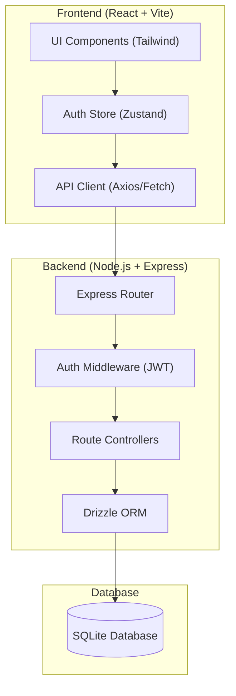

# Implementation Plan: Project Management System Full-Stack Transition

This document outlines the roadmap for evolving the current "ProjectHub" frontend prototype into a robust, production-ready full-stack application.

## 1. Project Overview

The current system is a high-fidelity frontend built with React, Vite, and Tailwind CSS. It uses a mock API service that persists data in `localStorage`. The goal is to implement a dedicated Node.js backend with an SQLite database to enable real multi-user functionality and permanent data persistence.

### Current Tech Stack
- **Frontend**: React 19, TypeScript, Vite, Tailwind CSS 4.
- **State Management**: Zustand.
- **Routing**: React Router 7.
- **Icons/UI**: Lucide React, Sonner (Toasts).
- **Mocking**: In-memory store with `localStorage` fallback.

### Target Tech Stack
- **Backend**: Node.js, Express.js.
- **Database**: SQLite (local development/production).
- **ORM**: Drizzle ORM (for type-safe SQL).
- **Authentication**: JWT (JSON Web Tokens) + bcrypt (password hashing).

---

## 2. Architecture Diagram

---

## 3. Implementation Phases

### Phase 1: Backend Foundation
- [ ] Initialize backend project structure within the workspace (e.g., `/server` or `/api`).
- [ ] Install dependencies: `express`, `cors`, `dotenv`, `better-sqlite3`, `drizzle-orm`.
- [ ] Set up Drizzle config and SQLite database connection.
- [ ] Implement a basic "Hello World" endpoint to verify connectivity.

### Phase 2: Database Schema & Authentication
- [ ] Define Drizzle schemas for:
    - `users`: id, email, password_hash, name, role, created_at.
    - `projects`: id, name, description, owner_id, created_at, updated_at.
    - `tasks`: id, project_id, title, description, status, priority, assignee_id, due_date, created_at.
    - `members`: project_id, user_id, role.
- [ ] Implement `POST /api/auth/signup` and `POST /api/auth/login`.
- [ ] Add password hashing with `bcryptjs`.
- [ ] Implement JWT generation and a `protect` middleware for secure routes.

### Phase 3: Project & Task API
- [ ] Implement Project endpoints:
    - `GET /api/projects` (with pagination/filtering).
    - `POST /api/projects` (creation).
    - `GET /api/projects/:id` (details).
    - `DELETE /api/projects/:id`.
- [ ] Implement Task endpoints:
    - `GET /api/projects/:projectId/tasks`.
    - `POST /api/projects/:projectId/tasks`.
    - `PATCH /api/tasks/:id` (status updates, assignments).
    - `DELETE /api/tasks/:id`.
- [ ] Add member invitation logic (`POST /api/projects/:id/members`).

### Phase 4: Frontend Migration
- [ ] Update `src/services/api.ts` to replace `mockApi` calls with real `fetch` or `axios` requests.
- [ ] Update `AuthStore` to handle real tokens and error responses from the backend.
- [ ] Refactor components to handle loading and error states from real API calls.
- [ ] Ensure `localStorage` is used only for the JWT token, not for application data.

### Phase 5: Polish & Deployment
- [ ] Add comprehensive error handling on both frontend and backend.
- [ ] Implement input validation (e.g., using `Zod` or `Joi`).
- [ ] Add request logging (e.g., `morgan`).
- [ ] Prepare `Dockerfile` for deployment or Railway configuration.

---

## 4. Key Considerations

> [!IMPORTANT]
> **Data Migration**: Since the current data is in `localStorage`, we should provide a way for users to "migrate" or simply start fresh on the new backend.
>
> **Security**: Ensure the `.env` file is never committed and contains the `JWT_SECRET`.
>
> **Performance**: Use SQLite indexing on `user_id`, `project_id`, and `assignee_id` to ensure the dashboard remains fast as data grows.

---

## 5. Next Steps

1. **Verify Backend Preferences**: Confirm if the user prefers a specific backend directory structure (e.g., nested in `/src` or a top-level `/server` folder).
2. **Start Phase 1**: Initialize the Express server and SQLite connection.
